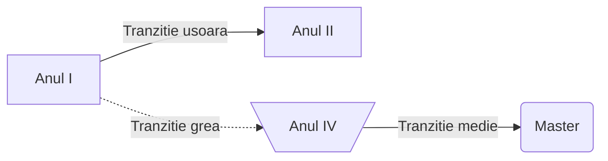

<script id="MathJax-script" async src="https://cdn.jsdelivr.net/npm/mathjax@3/es5/tex-mml-chtml.js"></script>

[Homepage](index.md)

# Diagrame de tip _flowchart_

```
flowchart LR
A[Anul I] --> |Tranzitie usoara| B[Anul II]
A -.-> |Tranzitie grea| C[\Anul IV/]
C --> |Tranzitie medie| D(Master)
```



** De retinut **
- Diagramele _flowchart_ _au noduri_ si _conectori_
- Nodurile au:
 - forma (data de parantezele folosite la descrierea _nodului_)
 - ID (sirul folosti in afra descrierii nodului)
 - Descriere (textul ce apare in caseta nodului si care este implementat in interiorul diferitelor tipuri de paranteze - ce decid forma casetei nodului)
 - Conectorii au:
   - Diferite tipuri de sageti sau chiar pot activa fara sageti
   - Diferite tipuri de linii: `-->` linie continua, `-.->` linie punctata, `--` linie continua fara sageti, `<-->` linie continua cu sageti in ambele sensuri, `==>` linie ingrosata cu sageata spre dreapta.
  
## Diagrame _flowchart_ avansate

```
A--> B & C & D --> E
```

# Diagrma de tip _timeline_

``'
title "My timeline"
section "sectiunea 1"

2023-2024
        : Am luat la facultate
        : Am luat contact cu mediul academic
2024-2025
        : Am terminat anul I
        : Am facut practica 

section "sectiunea 2"

2025-2026
        : Am facut practica la fotogrammetrie 
2027-2028
        : Anul terminal IV
        : Am terminat facultatea
```
